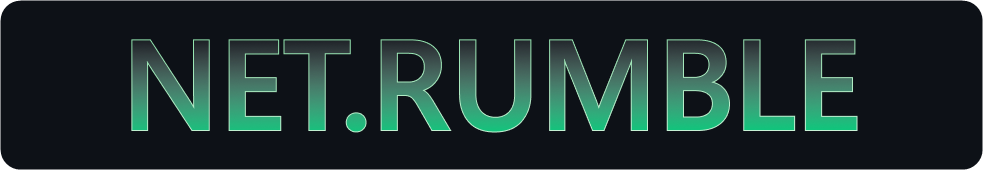

<p align="center">
  <picture>
    <source media="(prefers-color-scheme: dark)" srcset="docs/images/netrumble-banner-dark.png">
    
  </picture>
</p>

[![License: MIT][badge-license]][link-license]
[![MonoGame 3.8.5][badge-monogame]][link-monogame]
[![XBOX Series X|S][badge-console]][link-console]
[![Microsoft GDK supported][badge-gdk]][link-gdk]
[![PlayFab supported][badge-playfab]][link-playfab]
[![GameInput supported][badge-gameinput]][link-gameinput]
[![MonoGame GDK documentation][badge-docs]][link-docs]
[![Visit our Blog][badge-blog]][link-blog]
[![Join us on Discord][badge-discord]][link-discord]
[![PRs welcome][badge-prs]][link-prs]
[![Join the XBOX Developer Program][badge-devprogram]][link-devprogram]

# XBOX MonoGame NetRumble

**A complete multiplayer XBOX game, built in MonoGame.** NetRumble is a 2D top-down space
shooter. Dodge the asteroids, grab lasers, rockets and mines from a twenty-weapon arsenal,
and shoot your friends for points. Party voice chat, invites from the guide, achievements
and a saved match history are all included.

Every Microsoft **GDK** and **PlayFab** service in this sample is wired into the place a
shipping title would really call it, so you can watch sign-in, privileges, privacy, Party
networking and cloud save work around an actual game loop, and then go and play the result.

The game is written in C# against **MonoGame 3.8.5** and reaches the platform through
[XBOX GDK.NET](https://github.com/gaming-microsoft/gdk-dotnet), a managed projection of
the GDK, PlayFab and Party, behind a single `IPlatformProvider` boundary. The same game
sources build twice, for CoreCLR on the desktop and for XBOX Series X|S, and contain no
`#if` for either target. That boundary is the most reusable part of the sample. See
[Platform abstraction](docs/platform-abstraction.md).

> [!IMPORTANT]
> **This is a source-only sample rather than a shipping game.** NetRumble is MIT licensed
> at the game layer. The Microsoft GDK, PlayFab, Party and
> [XBOX GDK.NET](https://github.com/gaming-microsoft/gdk-dotnet) dependencies require
> their own installs and license acceptance, consistent with other XBOX samples.
>
> There is no fixed update cadence for support or maintenance. We watch the repository,
> monitor issues and iterate where it makes sense. We would like to hear your feedback and
> see your pull requests as this evolves.


## Quickstart

```powershell
git clone https://github.com/gaming-microsoft/gdk-dotnet.git
git clone https://github.com/gaming-microsoft/monogame-rumble.git
cd monogame-rumble
dotnet build NetRumble.slnx /p:NoWarn=NU1603
dotnet run --project src\NetRumble.Game
```

`/p:NoWarn=NU1603` is required and has to be passed as a global property. See
[Restore fails with NU1603](docs/troubleshooting.md#restore-fails-with-nu1603).

Full prerequisites, expected first-run behaviour and the other ways to run the game are in
[Getting started](docs/getting-started.md) and [Run modes](docs/run-modes.md).

## What the sample covers

XBOX identity exchanged for a PlayFab identity, PlayFab Lobby discovery, PlayFab Party as
the match transport, Party voice with speech-to-text captions, privileges, privacy, text
moderation, achievements, rich presence, invites from the guide, roaming cloud save,
process lifecycle and controller detection.

[Feature support](docs/feature-support.md) lists every feature against every environment,
including the LAN and offline paths that need no GDK at all.

> [!NOTE]
> This sample is still being built and some things are missing or broken. The controller
> glyphs are obvious placeholders rather than certification-compliant art, and the store
> logos are generated stand-ins. Read [Known gaps](docs/known-gaps.md) before you file a
> bug.

## Architecture at a glance

```
Program.cs                      Resolves the provider mode, then constructs the game
NetRumbleGame                   MonoGame Game: pumps the platform once per frame, owns the screen stack
IPlatformProvider               The only platform surface the game can see
  |- ...GameCore                XBOX GDK.NET: identity, Party, privileges, privacy, moderation, achievements
  |- ...PlayFab                 Lobby discovery, the authentication exchange, cloud save
  |- ...Lan                     A UDP transport with no GDK, title or account
  \- ...Offline                 A complete local and no-op fallback, always the last resort
MatchSession -> IMatchNetwork   Session, authoritative simulation and the wire codec
LifecycleCoordinator            Suspend, resume, constrain, account change, durable commit
InviteRouter                    Buffers platform activations until identity and the front end are ready
```

This is an ownership sketch rather than a startup order.

`NetRumble.Core` and `NetRumble.Game` reference **`NetRumble.Platform` only**, which is the
interface assembly and has no dependencies of its own. No `IntPtr`, `HRESULT`,
`XUserHandle` or SDK structure appears in any signature that crosses that line. Native
errors arrive as a `PlatformResult` the game branches on. The single exception is
`PlatformProviderFactory`, the composition root.

That rule is what let the port's hand-written P/Invoke layer be replaced with a managed GDK
projection without changing one file in the game.

## Documentation

| Page | Read it when |
|---|---|
| [Getting started](docs/getting-started.md) | You are building this for the first time |
| [Run modes](docs/run-modes.md) | You want two instances playing each other, or an unattended run |
| [Feature support](docs/feature-support.md) | You want to know what works where |
| [Platform abstraction](docs/platform-abstraction.md) | You want to reuse the provider boundary |
| [Platform services](docs/platform-services.md) | You are looking for the file that implements a feature |
| [Windows packaging](docs/windows-packaging.md) | You want an installable package |
| [Building for XBOX Series X\|S](docs/xbox-console-build.md) | You are an XBOX development partner |
| [Design notes](docs/design-notes.md) | You want the reasoning behind a decision |
| [Known gaps](docs/known-gaps.md) | Something is missing and you want to know whether that is deliberate |
| [Troubleshooting](docs/troubleshooting.md) | A build, install or sign-in step failed |

New to the GDK or PlayFab? Start with the
[MonoGame GDK documentation](https://aka.ms/XBOXMonoGameDocs), then use
[docs/](docs/) for everything specific to this port. For MonoGame itself, see the
[MonoGame documentation](https://docs.monogame.net/).

> [!IMPORTANT]
> **The online flows need access to this sample's title.** Sign-in, lobby discovery, Party,
> privileges, achievements and presence all run against this sample's own sandbox and
> title, which requires an XBOX publishing relationship and a test account from that
> sandbox.
>
> Without that access you can still clone, build and play Practice, or run real netcode
> between two processes over the **LAN** transport, which needs no GDK and no account at
> all. Join the [XBOX Developer Program](https://developer.microsoft.com/en-us/games/) to
> get started.

## Contributing

Pull requests are welcome. [CONTRIBUTING.md](CONTRIBUTING.md) explains the acceptance gate
and how to record a decision so it does not get undone later.

## License

This project is licensed under the MIT License. See [LICENSE](LICENSE) for the full text.

The PlayFab Party redistributable binaries vendored under `third_party/party/` are not
covered by that license. They ship under their own Microsoft terms. See
[third_party/party/README.md](third_party/party/README.md).

## Trademarks

This project may contain trademarks or logos for projects, products, or services.
Authorized use of Microsoft trademarks or logos is subject to and must follow
[Microsoft's Trademark & Brand Guidelines](https://www.microsoft.com/en-us/legal/intellectualproperty/trademarks/usage/general).
Use of Microsoft trademarks or logos in modified versions of this project must not cause
confusion or imply Microsoft sponsorship. Any use of third-party trademarks or logos is
subject to those third-party's policies.

[badge-license]: https://img.shields.io/badge/license-MIT-107C10
[link-license]: LICENSE
[badge-monogame]: https://img.shields.io/badge/MonoGame-3.8.5-E73C00
[link-monogame]: https://monogame.net/
[badge-console]: https://img.shields.io/badge/XBOX%20Series%20X%7CS-NativeAOT-107C10?logo=xbox&logoColor=white
[link-console]: docs/xbox-console-build.md
[badge-gdk]: https://img.shields.io/badge/Microsoft%20GDK-%E2%9C%93-107C10
[link-gdk]: https://github.com/microsoft/GDK/releases
[badge-playfab]: https://img.shields.io/badge/PlayFab-%E2%9C%93-107C10
[link-playfab]: docs/platform-abstraction.md
[badge-gameinput]: https://img.shields.io/badge/GameInput-%E2%9C%93-107C10
[link-gameinput]: docs/platform-abstraction.md
[badge-docs]: https://img.shields.io/badge/docs-Microsoft%20Learn-0078D4
[link-docs]: https://aka.ms/XBOXMonoGameDocs
[badge-blog]: https://img.shields.io/badge/Visit%20our-Blog-FFA500?logo=rss&logoColor=white
[link-blog]: https://developer.microsoft.com/en-us/games/articles/
[badge-discord]: https://img.shields.io/badge/Join%20us%20on-Discord-7289DA?logo=discord&logoColor=white
[link-discord]: https://aka.ms/msftgamedevdiscord
[badge-prs]: https://img.shields.io/badge/PRs-welcome-d6336c
[link-prs]: CONTRIBUTING.md
[badge-devprogram]: https://img.shields.io/badge/XBOX%20Developer%20Program-0B5D0B?logo=xbox&logoColor=white
[link-devprogram]: https://developer.microsoft.com/en-us/games/
